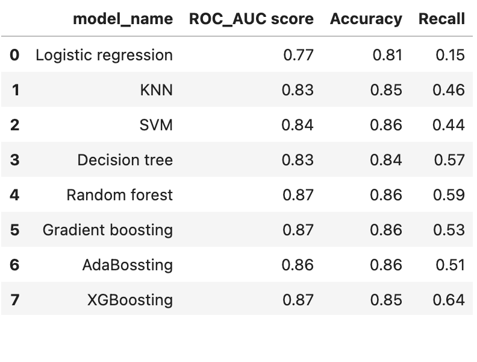

# Customer Churn Analysis

I use bank customer information, such as balance, gender, and age, to analyze whether a customer leave or remain with the bank.
Based on the analysis, I build a customer churn predicting model with machine learning methods.

Data can be downloaded from [here](https://www.kaggle.com/datasets/divu2001/customer-churn-rate/data]).

## Casual Inference

1. Age is a main factor to customer churn. Most of older customers have different financial priorities than younger customers, such as higher interest saving accounts or retirement products -
   which is unlikely to be the focus of the bank we study here. Therefore, Customers who leave tha bank are averagly older.

2. Many customers stay with the bank until passing away - this also contribute to the older age in the churn group.

3. Similary to the age factor, customers with higher balance might leave the bank because the bank does not offer more tailored services, such as wealth management.
   The bank we study here is possibly more conservative or smaller in business.

4. While customers with only one bank product are less engaged with the bank's offerings and tend to leave the bank, customers with more than three bank products have a extremely high churn rate
   and would leave the bank almost for sure. The multiple bank products they have are very likely multiple loans, and they get their accounts blocked ore closed by the bank due to not being able
   to return the money. This is also related to the lower credit score in the churn group.

Correlation of features and customer churn:

  
## Churn prediction

1. Since churn rate is generally much lower than 50%, datasets are mostly unbalanced in terms of customer churn.
   Therfore, we prioritize **recall** in the task of predicting customer churn. 

2. **XGBoosting model** has the best performance in predicting the customer churn for this dataset. Its recall, 64%, is significantly higher than the other models.
  
4. For the customer churn prediction task on this dataset, tree-based (e.g. decision tree) and ensemble models (e.g. random forest, XGBoosting) outperforme distance-based models (e.g. logistic regression, SVM).

 

5. After tunning threshold parameter for recall, the stacked model of the best three customer prediction models, **XGBoosting**, **random forest**, and **decision tree**,
   we could prevent 71% of the customer churn and reduce 50% of the loss.

